# Add to Cart Task Using Modal - React

- An Add to Cart ReactJS application that fetches product data from the Fake Store API and allows users to add products to the cart through a modal interface.

## Table of Contents

- introduction
- features
- installation
- design
- code-structure

## Introduction

- This application is built using ReactJS and utilizes the Fake Store API to fetch a list of products. The application displays the fetched products in a user-friendly format on the main page, allowing users to add products to the cart through a modal interface.

## Features:

- Fetches product data from the Fake Store API
- Displays products in a responsive layout
- Allows users to add products to the cart
- Displays the current cart items count in a Navbar component
- Opens a modal when the "Cart" button is clicked, displaying all products added to the cart includes a "Remove from Cart" button for each product in the modal
- Updates the cart value correctly when products are added or removed

## Installation:

- Open the URL - `https://add-to-cart-using-react.netlify.app/` in your browser to load the application.

## Design

- The application is designed to responsive and works well on both desktop and mobile devices. The products are displayed in a grid layout, with each product displaying key information such as the product image, title, price, and add to cart button.
- Modal technique used to display a list of product added to the cart.

## Code Structure

The code is structured into the following components:

- Main.jsx Higher-level component that wraps the App component
- App.jsx: The main application component
- ProductList.jsx: The product component, displaying key information about the products along with the add to cart button
- Navbar.jsx: The navbar component, displaying the current cart items count and the modal interface option
- CartModal.jsx: The modal component, displaying all products added to the cart and the remove from cart button

The application uses React Hooks to manage state and props are used to pass data down to child components.

## How to use / Demo:

- Overview of an application - User can see the list of product that fetched from `fakestoreapi`
  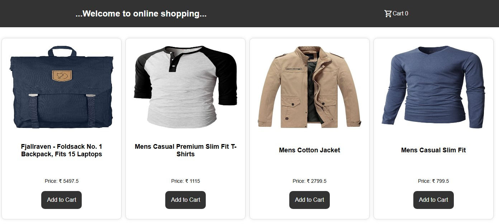
  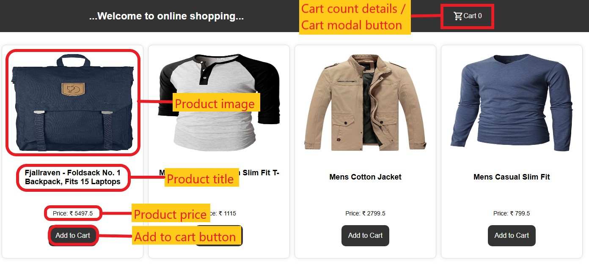

- Click `Add to Cart` button to add a specific product to the cart
  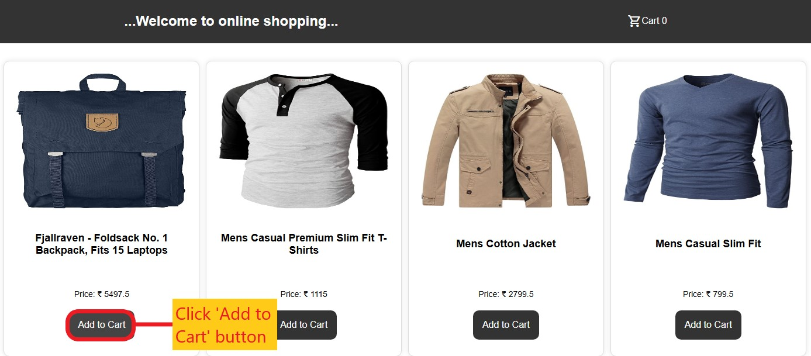

- Once clicked the `Add to Cart` button, Cart count will be updated.
  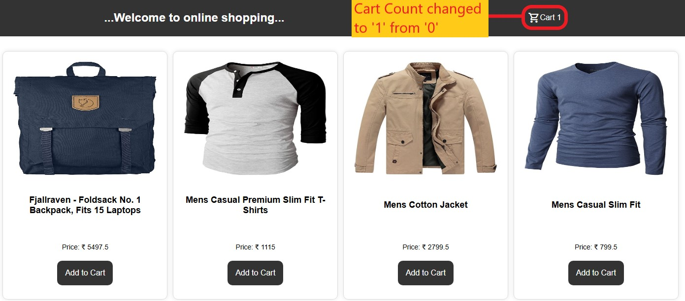

- Alert message will be displayed once user click the `Add to Cart` button if the product already in to the cart
  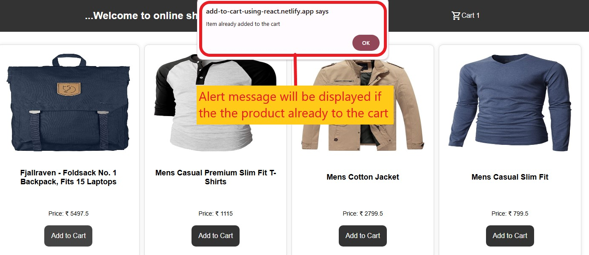

- Click the `Cart` button to display the cart modal.
  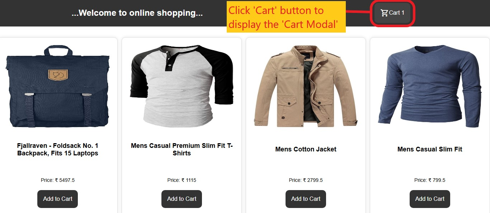

- Overview of a `Cart Modal`.
  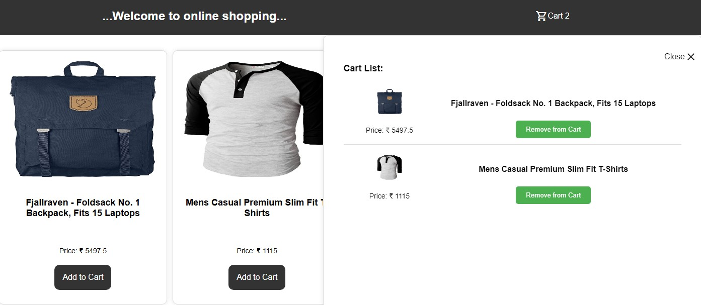
  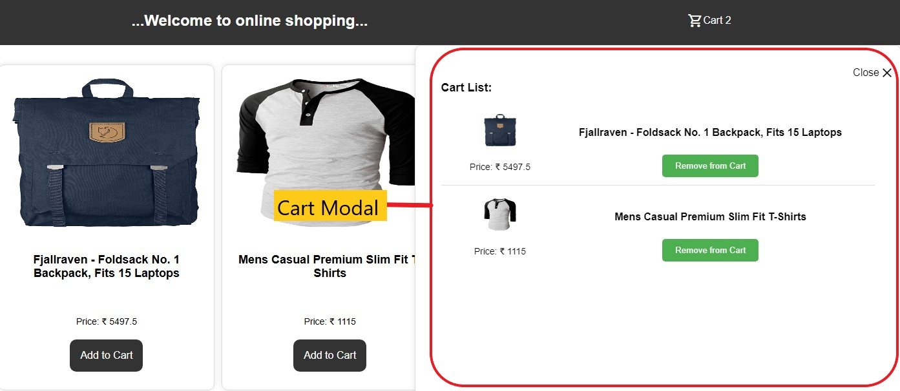
  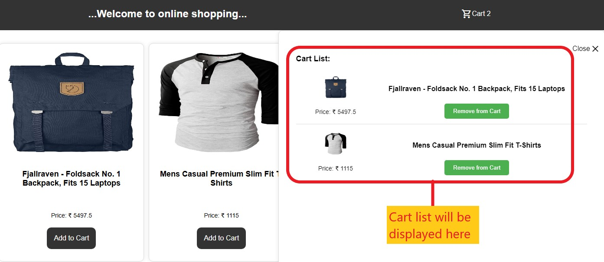
  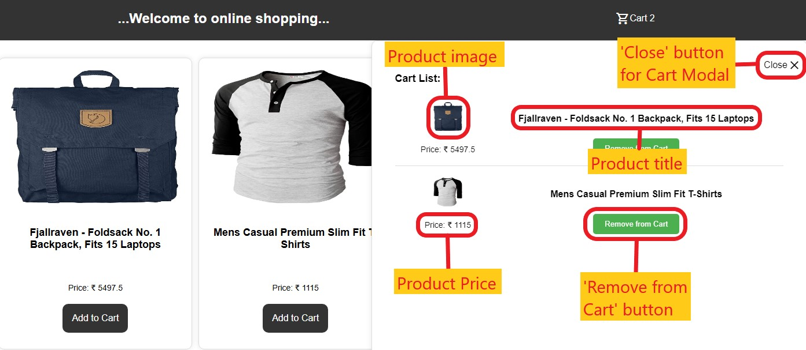

  - Click a `Remove from Cart` button to remove a product from the cart.
    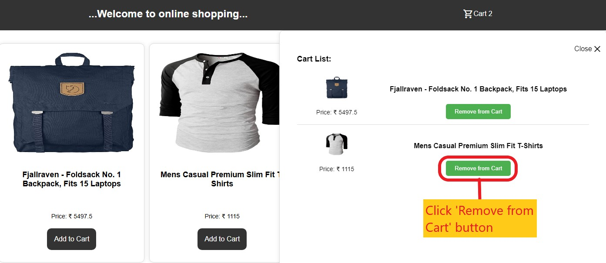

  - Click a `Close X` button to close the cart modal.
    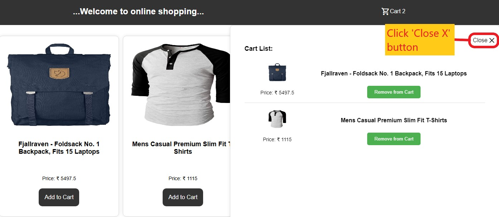
